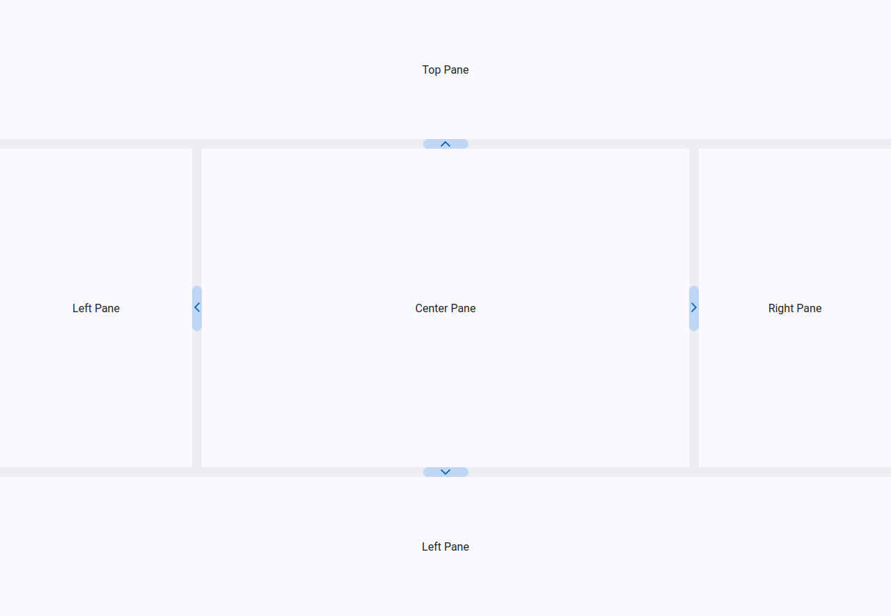

# Swift Layout

[](https://github.com/ryankugel/swift-layout/actions/workflows/build.yml)


A simple layout library for Angular, designed to mimic some of the functionality of the [jQuery UI Layout plugin](https://plugins.jquery.com/layout/).

## Getting started

### Installation
```shell
  npm install swift-layout
```

### Importing themes
Swift Layout includes a CSS file containing the default styles for the library called `swift-layout.css`. Multiple themes are also included
to match the default Material 3 themes:
  - `theme-blue.css`
  - `theme-green.css`
  - `theme-magenta.css`
  - `theme-red.css`

The `swift-layout.css` file, and an optional theme file, can be included in `angular.json`.

#### angular.json
```json
"styles": [
  "node_modules/swift-layout/assets/swift-layout.css",
  "node_modules/swift-layout/assets/theme-blue.css"
]
```

### Animations
Swift Layout resizes and toggles panes through Angular animations. Make sure your application includes the `BrowserAnimationsModule`.

#### BrowserAnimationsModule in modules
```typescript
import { BrowserModule } from '@angular/platform-browser';
import { BrowserAnimationsModule } from '@angular/platform-browser/animations';

@NgModule( {
  imports: [
    BrowserModule,
    BrowserAnimationsModule,
    //...
  ],
  //...
} )
export class AppModule {}
```

#### BrowserAnimationsModule in a standalone component

```typescript
import { ApplicationConfig, importProvidersFrom } from "@angular/core";
import { BrowserAnimationsModule } from "@angular/platform-browser/animations";

export const appConfig: ApplicationConfig = {
  providers: [
    importProvidersFrom( [ BrowserAnimationsModule ] ),
    //...
  ]
};
```

### Usage

In its simplest form, Swift Layout can be used to set up multiple resizable panes in a layout.

#### Minimal example
```angular2html
<swift-layout>
  <ng-template pane="left">
    <div class="pane-content-demo">Left Pane</div>
  </ng-template>

  <ng-template pane="right">
    <div class="pane-content-demo">Right Pane</div>
  </ng-template>

  <ng-template pane="center">
    <div class="pane-content-demo">Center Pane</div>
  </ng-template>

  <ng-template pane="top">
    <div class="pane-content-demo">Top Pane</div>
  </ng-template>

  <ng-template pane="bottom">
    <div class="pane-content-demo">Bottom Pane</div>
  </ng-template>
</swift-layout>
```

##### *Result*


A variety of options are provided by Swift Layout:
- Styles can be added to the layout using the `style` option.
- Panes can be mixed and matched to set up the desired layout. Only the `center` pane is required.
- The initial, minimum, and maximum sizes of panes can be defined through the `size`, `minSize`, and `maxSize` options, respectively.
These values are set as a percentage.
  - A size of 30% can be set as `[size]="30"` or `[size]="0.3"`
- The size of the resize bar in pixels can be set using the `gutterSize` option.
  - The gutter contains a toggle button, which can also have it's size customized using the `gutterToggleSize` & `gutterToggleSizeClosed` options.
    - The gutter toggle sizes can be input as a pixel size using any number greater than 1, or as a percentage using values between 0 and 1.
- Persisting the layout's state can be done by setting the `stateKey`. This key must be unique.
  - Layout state is persisted in either `localStorage` or `sessionStorage` depending on the value of the `stateStorage` option (defaults to `sessionStorage`).

#### Detailed example
```angular2html
<swift-layout stateKey="exampleLayout" stateStorage="local"
              [gutterSize]="20" [gutterToggleSize]="200" [gutterToggleSizeClosed]="0.5">
  <ng-template pane="left" [size]="30" [minSize]="10" [maxSize]="45">
    <div class="pane-content-demo">Left Pane</div>
  </ng-template>

  <ng-template pane="center">
    <div class="pane-content-demo">Center Pane</div>
  </ng-template>

  <ng-template pane="bottom" [size]="20" [minSize]="10" [maxSize]="45">
    <div class="pane-content-demo">Bottom Pane</div>
  </ng-template>
</swift-layout>
```

##### *Result*


---

## Custom Styling
The following is a list of CSS classes used by Swift Layout.

| Name                                       | Description                                           |
|--------------------------------------------|-------------------------------------------------------|
| `.swift-layout`                            | Top-level container for the layout                    |
| `.layout-pane-content`                     | Container of an individual pane                       |
| `.layout-pane-gutter`                      | The pane resize bar                                   |
| `.layout-pane-gutter.gutter-collapsed`     | The resize bar when the pane is closed                |
| `.layout-pane-gutter.pane-gutter-resizing` | The resize bar while resizing a pane                  |
| `.pane-gutter-resizing.invalid-resize`     | The resize bar when a resize exceeds the min/max size |
| `.layout-pane-gutter-toggle`               | The resize bar button to show/hide a pane             |

---

## Development
This repository includes a demo of Swift Layout that can be used for testing and debugging.

### Starting the demo
```shell
npm run start
```

The Swift Layout library can also be built through `npm` as a package.

### Building swift-layout
```shell
npm run build.lib
```
- This will build the library at `swift-layout/dist/swift-layout`.

#### Using the built library
The package created by `npm run build.lib` can be imported locally into a project for testing.

To use the locally-built package, add the `swift-layout` dependency to your `package.json` like this:
```json
"dependencies": {
  "swift-layout": "file:/path/to/swift-layout/dist/swift-layout"
}
```

And then run `npm install` to install the package.

---

## Credits
The resizing of panes was largely adapted from [PrimeNG's Splitter component](https://github.com/primefaces/primeng/tree/master/src/app/components/splitter).
